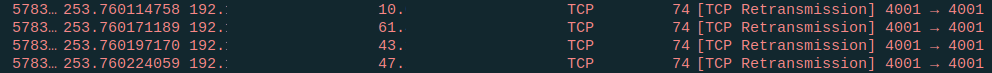

# LibP2P in IPFS breaking TCP and killing routers

A peculiar case came up recently when I was idling in #IPFSgeneral and someone said that anytime they connected
to the IPFS DHT their router stopped working, had to be power cycled and took 15 minutes to start back up.  
  
At first I asked the user for their router model and they admitted indeed their router is shit. I asked why they did not consider putting their ISP router into bridged mode and buying a decent router to put infront but it was not an option.  
  
Ok, well send me the .pcap, lets have a look, there is a slight chance it might be possible to find something. And find it was.  
  
The packet cap had something very peculiar about it as soon as it loaded, lets investigate.  
  
First lets check how exactly their IPFS is connecting to the outside world.  
We know IPFS listens on port 4001 for both TCP and QUIC.  
  
Outgoing TCP connections `tcp.flags.syn==1 && tcp.port==4001` (82k results)  
Outgoing UDP packets `udp` (0 results)  
Outgoing QUIC connections `quic` (0 results)  
  
So we established a baseline that UDP and QUIC are not used at all.  Now what is the TCP doing other than spamming 82k connection requests in a short amount of time.  


  
Right away we see a bunch of connections going from src port 4001 to dest port 4001, on both ends.  Wireshark
is also kind enough to warn us of this and that it is getting confused itself as there are overlapping socket tuples.  
  
Wait, overlapping socket tuples? A socket tuple is how the linux kernel keeps track of connections, each connection is stored as a tuple
`{proto, src_ip, src_port, dest_ip, dest_port}`.  In our case this would be `{tcp, 192.168.0.33, 4001, 30.30.30.30, 4001}` with `192.168.0.33` being our local ip address (behind our NAT), by TCP spec we can only have 1 such pair exist at any time, meaning if a second pair were to be created while the previous socket did not fully cleanup + got out of TIME_WAIT (or it has linger 0), chaos may ensue.  
  
The fact that port 4001 is being used each time to connect to all destiation ip addresses raised a red flag, and I quickly doublechecked if there is something I do not know about TCP, stackoverflow had a good answer here, and I was convinced that IPFS is breaking TCP spec but why.  
  
An excerpt from stackoverflow.  
```
Multiple connections on the same server can share the same server-side IP/Port pair
as long as they are associated with different client-side IP/Port pairs, and the 
server would be able to handle as many clients as available system resources allow it to.
```
  
While UDP (QUIC runs over UDP) can easily multiplex on a single src port (infact thats how it works), TCP cannot and already I am thinking of a plethora of conditions and wierd edge cases that can result from this if the app is not careful (and it is not, as the pcap has cases where 3 connections with the same socket_tuple_pair in the span on 3 seconds connect to the same destination).  
  
I told the user to disable TCP fully and just use QUIC which should multiplex properly. They reported back and said 
everything is running well now!  
  
But this is not satisfying, why is TCP in the app doing this. Back to #IPFSchatter and it turns out IPFS uses libp2p under the hood, which for better NAT holepunching binds to port 4001 for all outgoing connections! The behavior can be toggled using a 
settable envvar LIBP2P_TCP_REUSEPORT.  
  
Now I also brought to the users awareness to start IPFS with LIBP2P_TCP_REUSEPORT=false, and.. everything ran smooth again.  
  
The most likely conclusion, a poorly written router firmware, and an unlikely conclusion, should LIBP2P_TCP_REUSEPORT default to true? (especially since IPFS has proper holepunching now with Circuit Relay v2 upstream)  